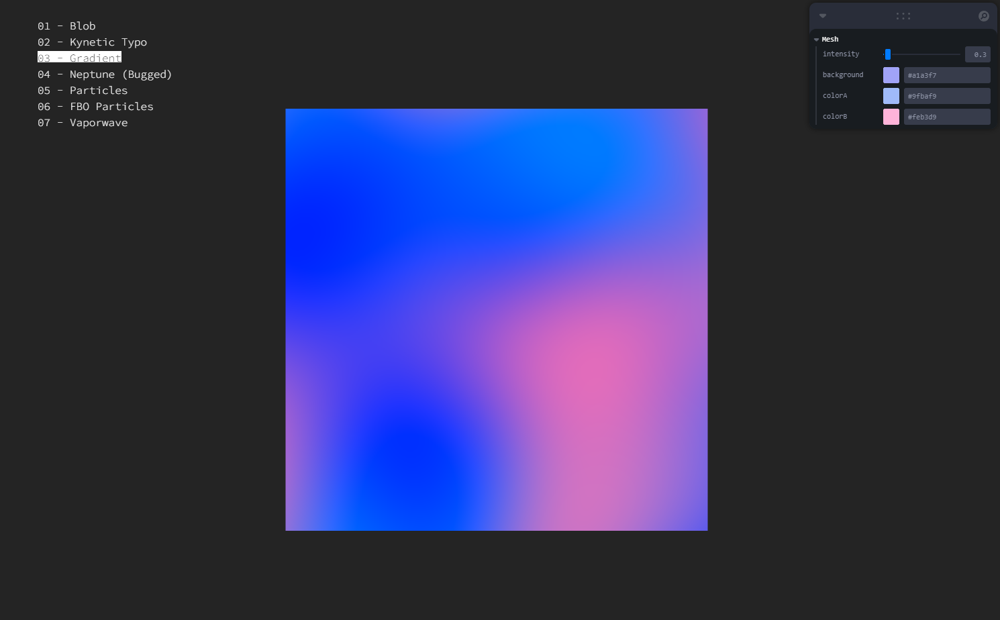

# Three Labs
Experimental Three.js / React Three laboratory



## Installation

The repository bundles the files using [Vite](https://vitejs.dev/), so make sure you have [Node](https://nodejs.org/en/) installed before running the next commands:

Install the dependencies:

```
npm install
```

Run the code and start a local server:

```
npm run dev
```

Create a build of the code:

```
npm run build
```
## Credits

- [Maxime Heckel's Blog](https://blog.maximeheckel.com/posts/the-magical-world-of-particles-with-react-three-fiber-and-shaders/)
- [The Book of Shaders](https://thebookofshaders.com/glossary/)

## Going further

- [Create Text in Three.js with Three-bmfont-text](https://tympanus.net/codrops/2019/10/10/create-text-in-three-js-with-three-bmfont-text/)
- [Kinetic Typography with Three.js](https://tympanus.net/codrops/2020/06/02/kinetic-typography-with-three-js/)

## Misc

Follow *@Fret0lol*: [Twitter](https://twitter.com/Fret0lol)